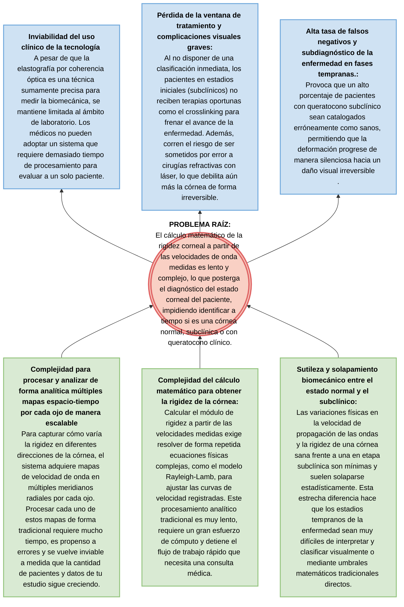

.

# Árbol de Problemas: Detección de Queratocono con OCE

**Problema Central:** La extracción y el análisis analítico/manual de parámetros biomecánicos en los mapas espacio-tiempo de velocidad de onda (OCE) hacen que la clasificación del queratocono (normal, subclínico, avanzado) sea un proceso lento, complejo y dependiente de expertos.

