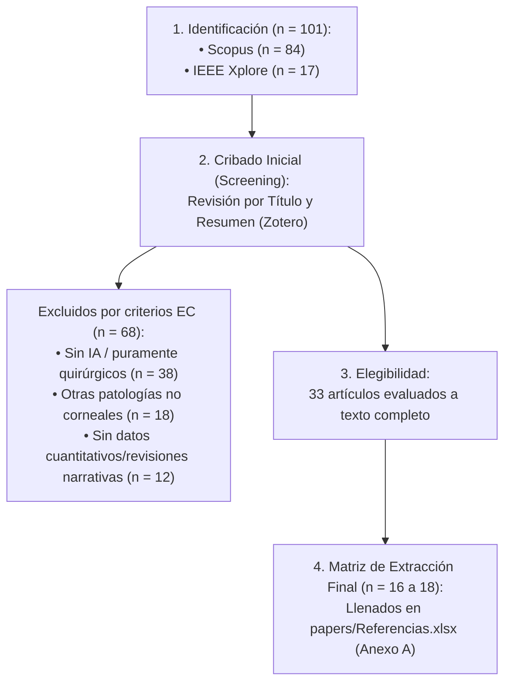
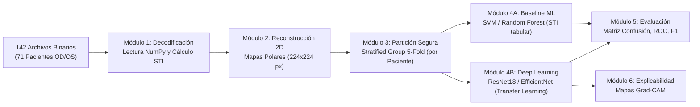

# 📘 Documento Maestro: Descripción del Proyecto, PICOC, Metodología y Estado del Arte

**Tema:** Clasificación de queratocono mediante modelos de aprendizaje profundo aplicados a mapas de rigidez corneal reconstruidos a partir de biomarcadores de velocidad de onda  
**Tesista:** Diego Alejandro Silvestre  
**Asesor:** Dr. César Beltrán Castañón (Inteligencia Artificial / Informática PUCP)  
**Co-asesor:** Dr. José Fernando Zvietcovich Zegarra (Grupo de Biofotónica / OCE / Datos)  
**Especialidad:** Ingeniería Informática — Pontificia Universidad Católica del Perú (PUCP)  
**Curso:** 1INF42 - Proyecto de Fin de Carrera 1 (2026-2)  

---

## 1. Fundamento Clínico y Físico del Problema

### A. La Problemática Médica: Detección Temprana del Queratocono
* El **queratocono** es una ectasia corneal progresiva no inflamatoria caracterizada por el adelgazamiento biomecánico y la deformación cónica del tejido corneal, lo que genera astigmatismo irregular severo y pérdida de visión.
* **El riesgo crítico (Pre-LASIK):** En cirugía refractiva con láser, operar a un paciente con queratocono en etapa incipiente (**Queratocono Subclínico o *Forme Fruste - FFKC***) desencadena una complicación iatrogénica devastadora (*ectasia post-LASIK*).
* **Falla de los sistemas actuales:** Los equipos clínicos estándar (topógrafos/tomógrafos como *Pentacam* o *OCT geométrico*) solo miden curvatura y elevación exterior. En etapa subclínica, la córnea mantiene su geometría aparentemente normal, haciendo invisible la patología en fases tempranas.

### B. La Técnica de Adquisición: OCE y Ondas de Lamb (Aporte del Laboratorio)
* **Elastografía por Coherencia Óptica (OCE):** Técnica desarrollada por el grupo de biofotónica que excita el tejido corneal mecánicamente y rastrea la propagación de **ondas de Lamb (*Lamb waves*)** en múltiples meridianos ($0^\circ, 22.5^\circ, 45^\circ, 67.5^\circ, 90^\circ$).
* **Principio físico:** 
  * En tejido sano y rígido $\rightarrow$ La onda viaja **rápido**.
  * En tejido patológico/ablandado $\rightarrow$ La onda viaja **lenta**.
* **Biomarcadores Físicos Clave:**
  1. **$\text{STI}$ (*Speed-Thickness Index*):** Desviación respecto a la recta de regresión normal entre espesor ($\mu\text{m}$) y velocidad ($m/\text{s}$). Valores $\text{STI} < 0$ indican ablandamiento tisular anormal ($\text{STI} \approx -0.01$ en sanos, $-0.38$ en subclínicos y $-1.22$ en queratocono clínico).
  2. **$\text{SAWS}$ (*Spatial Anisotropy of Wave Speed*):** Cuantifica la asimetría de propagación entre meridianos (anisotropía fraccional NFA), significativamente elevada en córneas afectadas.
  3. **Mapas Polares 2D:** Reconstrucción espacial en 2D de la distribución continua de rigidez y velocidad corneal.

---

## 2. Protocolo PICOC Formal y Blindado

| Componente | Definición | Aplicación en la Tesis |
| :--- | :--- | :--- |
| **P** *(Population)* | Población / Muestra | **142 córneas (71 pares binoculares OD/OS de pacientes)** evaluadas con elastografía OCE y distribuidas en 3 clases clínicas: **Normal (Control)**, **Queratocono Subclínico (*Forme Fruste*)** y **Queratocono Clínico**. |
| **I** *(Intervention)* | Intervención / Propuesta | Pipeline de **Deep Learning** (redes convolucionales preentrenadas: ResNet-18, EfficientNet-B0) con transfer learning, data augmentation y partición agrupada por paciente (*Group K-Fold*) sobre **mapas 2D polares de rigidez / STI**. |
| **C** *(Comparison)* | Comparación | 1. Diagnóstico geométrico estándar (*Pentacam / OCT topográfico*).<br>2. Modelos de Machine Learning clásico (SVM con kernel RBF, Random Forest, XGBoost) sobre features tabulares ($\text{STI}$ medio, $\text{SAWS}$).<br>3. Clasificación por corte escalar univariado de $\text{STI}$. |
| **O** *(Outcome)* | Métricas y Resultados | • Exactitud global balanceada ($\ge 90\%$), Macro F1-Score ($\ge 0.88$) y AUC-ROC multiclase ($\ge 0.92$).<br>• Alta sensibilidad/recall en la clase **Subclínico** ($\ge 85\%$).<br>• Mapas de explicabilidad visual (**Grad-CAM**) con validación de concordancia anatómica. |
| **C** *(Context)* | Contexto Clínico | Sistemas CAD (*Computer-Aided Diagnosis*) para **screening y evaluación preoperatoria de cirugía refractiva (pre-LASIK)** en clínicas oftalmológicas. |

---

## 3. Preguntas de Investigación (PI) para el Estado del Arte (E1)

* **PI1 (Arquitecturas de Aprendizaje Profundo en Datasets Reducidos):**  
  > *¿Qué arquitecturas de redes neuronales convolucionales (ej. ResNet, EfficientNet) y técnicas de transfer learning / data augmentation ofrecen mayor robustez y previenen el sobreajuste para la clasificación de mapas 2D médicos con muestras limitadas ($N < 300$)?*

* **PI2 (Biomarcadores de OCE y Biomecánica Corneal):**  
  > *¿De qué manera los biomarcadores biomecánicos basados en elastografía OCE (velocidad de ondas de Lamb, índice STI y anisotropía espacial SAWS) permiten discriminar estadios subclínicos frente a los índices topográficos convencionales?*

* **PI3 (Desempeño, Sensibilidad y Brechas en Queratocono Subclínico):**  
  > *¿Qué niveles de exactitud y sensibilidad reportan los sistemas actuales de inteligencia artificial al clasificar queratocono subclínico frente a córneas sanas, y cuáles son las principales limitaciones metodológicas identificadas en la literatura?*

---

## 4. Estrategia de Búsqueda Sistemática (Protocolo PRISMA)

### A. Ecuaciones de Búsqueda Booleanas (Derivadas del PICOC)

#### 1. Scopus (Cadena principal de extracción — 84 resultados base en `papers/ris/SCOPUS_EXPORTADO_21-0802026.ris`):
```sql
TITLE-ABS-KEY (
  ( "keratoconus" OR "corneal ectasia" OR "forme fruste" OR "subclinical keratoconus" )
  AND ( "optical coherence elastography" OR "OCE" OR "Lamb wave*" OR "shear wave*" OR "corneal biomechanic*" OR "stiffness map*" )
  AND ( "deep learning" OR "machine learning" OR "convolutional neural network*" OR "CNN" )
  AND ( "classification" OR "detection" OR "early diagnosis" OR "screening" )
)
```

#### 2. IEEE Xplore (Cadena complementaria de ingeniería y procesamiento):
```sql
( ("Document Title":"keratoconus" OR "Abstract":"keratoconus" OR "Abstract":"corneal ectasia")
  AND ("Abstract":"elastography" OR "Abstract":"biomechanic*" OR "Abstract":"wave speed")
  AND ("Abstract":"deep learning" OR "Abstract":"neural network" OR "Abstract":"machine learning") )
```

### B. Criterios de Selección

* **Criterios de Inclusión (IC):**
  * **IC1:** Publicaciones en revistas o conferencias indexadas (Scopus / IEEE / PubMed) entre 2019 y 2026.
  * **IC2:** Aplicación de Machine Learning o Deep Learning para detección, estadificación o pronóstico de queratocono.
  * **IC3:** Empleo de datos biomecánicos, elastografía (OCE, Corvis ST) o mapas de rigidez.
  * **IC4:** Evaluación de estadios tempranos o queratocono subclínico (*Forme Fruste*).

* **Criterios de Exclusión (EC):**
  * **EC1:** Documentos sin acceso a texto completo.
  * **EC2:** Estudios puramente quirúrgicos o farmacológicos sin algoritmos de software/IA.
  * **EC3:** Patologías oculares ajenas a la córnea (retina, glaucoma).
  * **EC4:** Editoriales breves, cartas al editor o revisiones narrativas sin datos cuantitativos.

### C. Flujo de Selección de Artículos (Protocolo PRISMA Oficial)


---

## 5. Pipeline Técnico del Proyecto (Ingeniería de Software e IA)



### Detalle de Módulos de Software (`src/`):
1. **`src/data/` (Resultado 1):** Ingesta de archivos binarios crudos, extracción de la velocidad de fase de ondas de Lamb ($\sim 3500\text{ Hz}$), cálculo del índice $\text{STI}$ y generación de imágenes polarizadas $224 \times 224$ píxeles.
2. **`src/models/` (Resultado 2):** Pipeline de entrenamiento en PyTorch implementando validación cruzada estratificada por paciente (`GroupKFold`), modelos convolucionales preentrenados (`timm`/`torchvision`), y baselines en `scikit-learn`.
3. **`src/evaluation/` (Resultado 3):** Generación automática de matrices de confusión, curvas ROC multiclase, reportes de clasificación y mapas de calor explicables con **Grad-CAM**.

---

## 6. Mapeo de Entregables según Rúbrica PUCP (1INF42)

| Hito | Semana | Contenido Principal Requerido | Visto Bueno |
| :--- | :---: | :--- | :---: |
| **Cronograma** | Sem 1 (22-ago) | Cronograma formal del ciclo con avances semanales y reuniones de asesoría. | Asesor |
| **Entregable E1** | Sem 4 (12-sep) | Problemática (Árbol de problemas), Estado del arte (PRISMA + 3 PI), Objetivos con IOV, Cronograma y **Anexo A (`papers/Referencias.xlsx`)**. | Asesor $\rightarrow$ Profesor |
| **Entregable E2** | Sem 8 (09-oct) | Levantamiento de observaciones del E1, Marco conceptual/teórico/legal (Ley N° 29733 y FDA), Herramientas, métodos y procedimientos detallados. | Asesor $\rightarrow$ Profesor |
| **Entregable E3** | Sem 13 (14-nov) | Proyecto de fin de carrera completo: todas las correcciones, Anexo Plan de Proyecto (EDT, riesgos, presupuesto) y **Avance de un resultado (Resultado 1 y clasificador funcional)**. | Asesor $\rightarrow$ Jurado |
