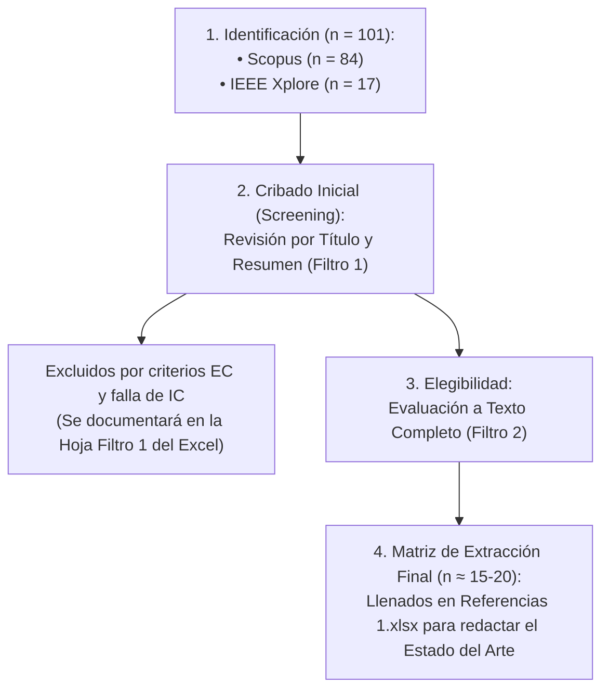
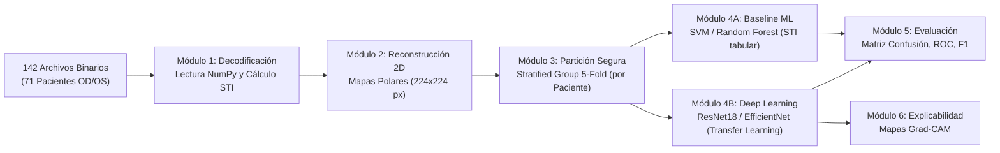

# 📘 Documento Maestro: Descripción del Proyecto, PICOC, Metodología y Estado del Arte

**Tema:** Clasificación de queratocono mediante modelos de aprendizaje profundo aplicados a mapas de rigidez corneal reconstruidos a partir de biomarcadores de velocidad de onda  
**Tesista:** Diego Alejandro Silvestre  
**Asesor:** Dr. César Beltrán Castañón (Inteligencia Artificial / Informática PUCP)  
**Co-asesor:** Dr. José Fernando Zvietcovich Zegarra (Grupo de Biofotónica / OCE / Datos)  
**Especialidad:** Ingeniería Informática — Pontificia Universidad Católica del Perú (PUCP)  
**Curso:** 1INF42 - Proyecto de Fin de Carrera 1 (2026-2)  

---

## 1. Fundamento del Problema (Alineado al Árbol de Problemas)

El proyecto aborda la dificultad de clasificar de forma precisa el estado de la córnea (normal, subclínico y avanzado), un proceso actualmente ineficiente debido a las siguientes causas fundamentales:

### A. Limitaciones Clínicas y Sutileza de la Enfermedad
* **El riesgo crítico (Pre-LASIK):** Operar con láser a un paciente con queratocono incipiente (**Queratocono Subclínico o *Forme Fruste - FFKC***) desencadena una complicación iatrogénica devastadora (*ectasia post-LASIK*).
* **Limitación de parámetros morfológicos (Topografía):** Los equipos clínicos estándar solo miden geometría. Al no medir directamente el debilitamiento biomecánico temprano de la córnea, fallan en la detección subclínica.
* **Sutileza de los cambios tempranos:** Las variaciones biomecánicas entre un ojo sano y uno con queratocono subclínico son extremadamente sutiles y se solapan estadísticamente, haciendo que los métodos de clasificación manual y los umbrales simples sean ineficientes.

### B. El Reto Biomecánico y la Pérdida de Información Analítica
* **Elastografía por Coherencia Óptica (OCE):** Para superar las limitaciones morfológicas, el laboratorio de biofotónica utiliza OCE para rastrear la propagación de **ondas de Lamb** y generar biomarcadores como el índice $\text{STI}$ (*Speed-Thickness Index*) y reconstrucciones en **Mapas Polares 2D**.
* **Complejidad física de los datos:** La propagación de estas ondas mecánicas exhibe un comportamiento no lineal altamente complejo, acoplado a variables como la anisotropía y el espesor.
* **Pérdida de información en el análisis tradicional:** Reducir esta rica información espacio-temporal (Mapas 2D polares) a simples promedios escalares o índices tabulares omite patrones implícitos y asimetrías cruciales para lograr una clasificación precisa.

### C. El Aporte de la Ingeniería Informática (La Solución)
**Nota metodológica:** La extracción de datos físicos y matemáticos a partir del OCE es labor del equipo de Biofotónica (Dr. Zvietcovich). El aporte informático de esta tesis **no** es construir la máquina clínica, sino **construir una arquitectura de Inteligencia Artificial (Deep Learning)** capaz de extraer características profundas directamente de los datos del OCE, evitando la pérdida de información del procesamiento analítico tabular y automatizando la detección del queratocono subclínico con alta precisión.

---

## 2. Protocolo PICOC Formal y Blindado

| Componente | Definición | Aplicación en la Tesis |
| :--- | :--- | :--- |
| **P** *(Population)* | Población / Muestra | **142 córneas (71 pares binoculares OD/OS de pacientes)** evaluadas con elastografía OCE y distribuidas en 3 clases clínicas: **Normal (Control)**, **Queratocono Subclínico (*Forme Fruste*)** y **Queratocono Clínico**. |
| **I** *(Intervention)* | Intervención / Propuesta | Pipeline de **Deep Learning** (redes convolucionales preentrenadas: ResNet-18, EfficientNet-B0) con transfer learning, data augmentation y partición agrupada por paciente (*Group K-Fold*) sobre **datos/mapas 2D de rigidez (OCE)**. |
| **C** *(Comparison)* | Comparación | 1. Diagnóstico geométrico estándar (*Pentacam / OCT topográfico*).<br>2. Modelos de Machine Learning clásico (SVM con kernel RBF, Random Forest, XGBoost) sobre features tabulares ($\text{STI}$ medio, $\text{SAWS}$).<br>3. Clasificación por corte escalar univariado de $\text{STI}$. |
| **O** *(Outcome)* | Métricas y Resultados | • Exactitud global balanceada ($\ge 90\%$), Macro F1-Score ($\ge 0.88$) y AUC-ROC multiclase ($\ge 0.92$).<br>• Alta sensibilidad/recall en la clase **Subclínico** ($\ge 85\%$).<br>• Mapas de explicabilidad visual (**Grad-CAM**) con validación de concordancia anatómica. |
| **C** *(Context)* | Contexto Clínico | Sistemas CAD (*Computer-Aided Diagnosis*) para **screening y evaluación preoperatoria de cirugía refractiva (pre-LASIK)** en clínicas oftalmológicas. |

---

## 3. Objetivos de la Tesis y Resultados (IOV)

*   **Objetivo General:** Desarrollar y validar un pipeline computacional basado en redes neuronales convolucionales para la clasificación automatizada de queratocono (normal, subclínico y clínico) a partir de mapas/datos espaciales de velocidad de onda (OCE), optimizando el tiempo de procesamiento y la precisión diagnóstica.
*   **Objetivos Específicos & Resultados Esperados (IOV):**
    1.  **OE1:** Preprocesar y consolidar el dataset de datos OCE provenientes de 142 córneas (71 pacientes) para su compatibilidad con arquitecturas profundas.
        *   *Resultado 1:* Dataset estructurado y particionado (Group K-Fold).
        *   *IOV:* Repositorio de datos/metadatos documentado en formato CSV/HDF5.
    2.  **OE2:** Diseñar y entrenar modelos de Deep Learning (ej. ResNet, EfficientNet) empleando transferencia de aprendizaje para extraer características latentes de los datos de rigidez.
        *   *Resultado 2:* Algoritmo de clasificación entrenado.
        *   *IOV:* Repositorio de código (GitHub) con el script de entrenamiento y archivo de pesos (`.pth` o `.h5`).
    3.  **OE3:** Evaluar el rendimiento diagnóstico del modelo mediante métricas de clasificación multiclase (AUC-ROC, F1-Score) y métodos de interpretabilidad visual (Grad-CAM).
        *   *Resultado 3:* Reporte técnico de validación del modelo.
        *   *IOV:* Documento de reporte (o notebook de evaluación) detallando matrices de confusión y mapas de activación.

---

## 4. El Marco Comparativo del Estado del Arte

Antes de definir las preguntas de investigación, es vital establecer **contra qué** se comparará el modelo de esta tesis. Dado que el cruce exacto entre "OCE + Deep Learning" es un territorio altamente inexplorado, el Estado del Arte (la revisión PRISMA) se nutre de la competencia tecnológica dividida en 3 grandes grupos:

1.  **Grupo 1 (El Baseline Geométrico):** Modelos de IA entrenados con mapas de **Topografía/Tomografía** (ej. Pentacam, Scheimpflug).
    *   *Propósito en la tesis:* Demostrar que, incluso con la mejor arquitectura informática (como CNNs complejas), la topografía tiene un techo de rendimiento y falla en los casos subclínicos por ignorar la rigidez del ojo.
2.  **Grupo 2 (El Baseline Biomecánico Básico):** Modelos de IA entrenados con parámetros de deformación por aire (ej. Corvis ST, ORA).
    *   *Propósito en la tesis:* Demostrar que añadir biomecánica mejora la detección, pero la falta de resolución espacial (mapas densos) sigue limitando los resultados frente al OCE.
3.  **Grupo 3 (La Frontera Espacio-Temporal - El Terreno de la Tesis):** Elastografía de Coherencia Óptica (OCE).
    *   *Propósito en la tesis:* Demostrar que el OCE soluciona la resolución espacial y la medición de rigidez, pero requiere **Deep Learning** (el aporte central de esta tesis) para automatizar el cuello de botella de la extracción matemática manual de características.

---

## 5. Preguntas de Investigación (PI) para el Estado del Arte

Las preguntas de investigación (PI) guiarán el análisis crítico de los artículos seleccionados en la revisión PRISMA:

* **PI 1 (Arquitectura Informática y Automatización):**  
  > *¿De qué manera las arquitecturas de Inteligencia Artificial permiten analizar directamente datos crudos espaciales o espacio-temporales (topografía o biomecánica), automatizando la extracción de características para la detección del queratocono?*
* **PI 2 (Efectividad en Diagnóstico Subclínico):**  
  > *¿Qué tan efectiva es la clasificación automatizada con Inteligencia Artificial para diferenciar el queratocono subclínico de una córnea normal, y qué rol juegan los diferentes tipos de biomarcadores de entrada en su desempeño?*
* **PI 3 (Explicabilidad Clínica y Confianza Médica):**  
  > *¿De qué manera la integración de técnicas de explicabilidad visual (como mapas Grad-CAM) contribuye a la validación clínica de las predicciones de IA en el diagnóstico temprano del queratocono?*

---

## 6. Estrategia de Búsqueda Sistemática (Protocolo PRISMA)

### A. Ecuaciones de Búsqueda Booleanas (Derivadas del PICOC)

#### 1. Scopus (Cadena principal de extracción — 84 resultados base):
```sql
TITLE-ABS-KEY (
  ( "keratoconus" OR "corneal ectasia" OR "forme fruste" OR "subclinical keratoconus" )
  AND ( "optical coherence elastography" OR "OCE" OR "Lamb wave*" OR "shear wave*" OR "corneal biomechanic*" OR "stiffness map*" )
  AND ( "deep learning" OR "machine learning" OR "convolutional neural network*" OR "CNN" )
  AND ( "classification" OR "detection" OR "early diagnosis" OR "screening" )
)
```

#### 2. IEEE Xplore (Cadena complementaria de ingeniería y procesamiento):
```sql
( ("Document Title":"keratoconus" OR "Abstract":"keratoconus" OR "Abstract":"corneal ectasia")
  AND ("Abstract":"elastography" OR "Abstract":"biomechanic*" OR "Abstract":"wave speed")
  AND ("Abstract":"deep learning" OR "Abstract":"neural network" OR "Abstract":"machine learning") )
```

### B. Criterios de Selección Oficiales (Filtros de Lectura)

* **Criterios de Inclusión (IC):**
  * **IC1:** Publicaciones en revistas o **conferencias indexadas** (Scopus / IEEE / PubMed) entre 2019 y 2026. *(Nota para el tesista: Las conferencias de informática como IEEE son vitales para obtener los algoritmos de IA más modernos que no salen en revistas médicas)*.
  * **IC2:** Aplicación de Machine Learning o Deep Learning para detección, estadificación o pronóstico de queratocono.
  * **IC3:** El estudio debe utilizar datos provenientes de **Topografía/Tomografía corneal** (ej. Pentacam), o de **Biomecánica corneal** (ej. Corvis ST, ORA, Elastografía OCE) como entrada para los modelos de IA. *(Nota para el tesista: Esta regla asegura que los artículos se alineen perfectamente con los 3 Grupos Tecnológicos del Marco Comparativo definidos arriba)*.
  * **IC4:** Evaluación de estadios tempranos o queratocono subclínico (*Forme Fruste*).

* **Criterios de Exclusión (EC):**
  * **EC1:** Documentos sin acceso a texto completo (ej. abstract-only posters).
  * **EC2:** Estudios puramente quirúrgicos o farmacológicos sin algoritmos de software/IA.
  * **EC3:** Patologías oculares ajenas a la córnea (retina, glaucoma).
  * **EC4:** Editoriales breves, cartas al editor o revisiones narrativas sin datos cuantitativos de rendimiento. *(Nota para el tesista: Estas revisiones teóricas deben guardarse en una carpeta aparte para redactar el Marco Teórico, pero son eliminadas de la tabla final PRISMA).*

### C. Flujo de Selección de Artículos (Protocolo PRISMA Oficial)


---

## 7. Pipeline Técnico del Proyecto (Ingeniería de Software e IA)

*(Sujeto a confirmación del formato final de los datos de OCE)*



### Detalle de Módulos de Software (`src/`):
1. **`src/data/` (Resultado 1):** Ingesta de archivos binarios crudos, extracción de la velocidad de fase de ondas de Lamb ($\sim 3500\text{ Hz}$), cálculo del índice $\text{STI}$ y generación de imágenes polarizadas $224 \times 224$ píxeles.
2. **`src/models/` (Resultado 2):** Pipeline de entrenamiento en PyTorch implementando validación cruzada estratificada por paciente (`GroupKFold`), modelos convolucionales preentrenados (`timm`/`torchvision`), y baselines en `scikit-learn`.
3. **`src/evaluation/` (Resultado 3):** Generación automática de matrices de confusión, curvas ROC multiclase, reportes de clasificación y mapas de calor explicables con **Grad-CAM**.
