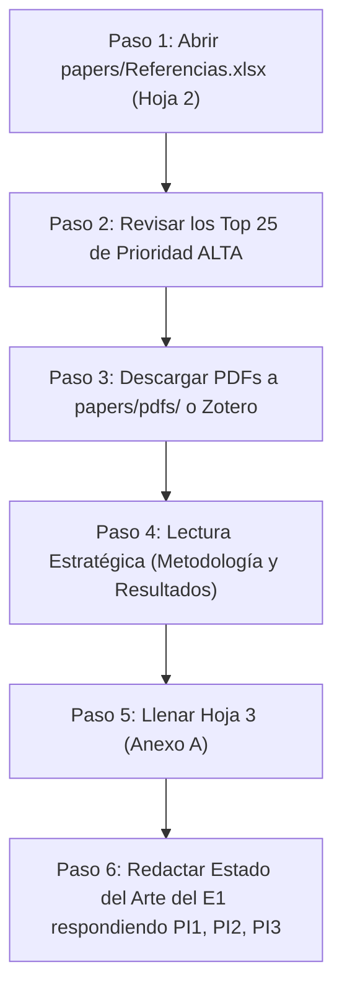

# 📘 Bitácora de Asesoría: Protocolo PRISMA, Preguntas de Investigación y Plan de Ejecución

**Tesista:** Diego Alejandro Silvestre  
**Tema de Tesis:** Clasificación de queratocono mediante modelos de aprendizaje profundo aplicados a mapas de rigidez corneal reconstruidos a partir de biomarcadores de velocidad de onda  
**Curso:** 1INF42 - Proyecto de Fin de Carrera 1 (PUCP 2026-2)  
**Fecha de Sesión:** 24 de agosto de 2026  

---

## 1. Glosario de Conceptos Clave (En Sencillo)

| Concepto | Definición en Sencillo | Aplicación en tu Tesis |
| :--- | :--- | :--- |
| **Biomarcador** | Cualquier medida física o biológica del cuerpo que indica salud o enfermedad (como la temperatura con la fiebre). | La **velocidad de onda de Lamb**, el índice **STI** ($V/\text{espesor}$) y el **mapa 2D de rigidez**. |
| **Queratocono Subclínico (*Forme Fruste*)** | Etapa temprana de la enfermedad donde el ojo aún no se deforma por fuera pero ya está "blando" por dentro. | El objetivo central de la tesis: detectarlo tempranamente antes de una cirugía LASIK. |
| **Transfer Learning** | Reutilizar una red neuronal ya entrenada con millones de imágenes (ImageNet) para aprender tu tarea médica sin sobreajustarse. | Usar **ResNet-18** o **EfficientNet-B0** congelando el 95% de las capas y solo entrenando la capa final de 3 clases. |
| **Data Augmentation** | Crear variaciones leves de tus 142 imágenes (rotaciones de $\pm 10^\circ$, traslaciones) para multiplicar el dataset efectivo. | Prevenir el sobreajuste (*overfitting*) en datasets médicos pequeños ($N < 300$). |
| **Protocolo PRISMA** | Metodología estándar internacional para buscar, filtrar y seleccionar artículos científicos de forma reproducible y transparente. | Justificar la selección de 20-25 papers a partir de los 101 identificados en Scopus e IEEE. |

---

## 2. Las 3 Preguntas de Investigación (PI) Definitivas

* **PI1 (Modelos de IA en Conjuntos Reducidos):**  
  > *¿Qué arquitecturas de redes neuronales convolucionales (ej. ResNet, EfficientNet) y técnicas de transfer learning / data augmentation se utilizan en la literatura médica para clasificar patologías corneales en conjuntos de datos reducidos ($N < 300$)?*

* **PI2 (Biomarcadores y Rigidez vs. Topografía):**  
  > *¿De qué manera los biomarcadores biomecánicos basados en elastografía y ondas de propagación (velocidad de onda, relación velocidad/grosor STI y rigidez) permiten discriminar estadios tempranos frente a los índices topográficos convencionales?*

* **PI3 (Desempeño y Brechas en Queratocono Subclínico):**  
  > *¿Qué niveles de exactitud y sensibilidad reportan los sistemas actuales de inteligencia artificial al clasificar queratocono subclínico frente a córneas sanas, y cuáles son las principales limitaciones metodológicas identificadas en la literatura?*

---

## 3. Estructura del Archivo Excel (`papers/Referencias.xlsx`)

El archivo Excel del proyecto contiene 4 hojas articuladas:
1. **`1. Protocolo & PICOC`:** Matriz PICOC, definición de las 3 PI y cadenas de búsqueda exactas de Scopus (84) e IEEE (17).
2. **`2. PRISMA - Cribado Total (101)`:** Lista de los 101 artículos con menús desplegables de decisión (`Pasa a Elegibilidad`, `Excluido`), motivos de exclusión (`EC1-EC4`), etiquetas de aporte a PI y semáforo de colores por prioridad (Verde = Alta, Amarillo = Media, Naranja = Baja).
3. **`3. Anexo A - Matriz Extracción`:** Tabla comparativa formal requerida por la rúbrica PUCP para los 20-25 papers seleccionados.
4. **`4. Resumen Flujo PRISMA`:** Conteo cuantitativo formal para el diagrama de flujo del informe E1.

---

## 4. Guía Paso a Paso para el Tesista (Semana 2 y 3)

### Detalle de cada paso:

1. **Paso 1: Abrir el Excel:** Ve a la **Hoja 2 (`2. PRISMA - Cribado Total`)**. Los artículos de prioridad **ALTA (Verde)** ya están ordenados en las primeras filas.
2. **Paso 2: Validar el cribado rápido (30 seg por paper):** Lee el título y el abstract. Si confirma que usa IA + Queratocono/Biomecánica, déjalo como `Pasa a Elegibilidad`. Si encuentras alguno que hable de cirugías o no tenga que ver, usa el desplegable y márcalo como `Excluido en Cribado`.
3. **Paso 3: Descargar los PDFs:** Descarga los 20-25 artículos que más te gusten y guárdalos en `papers/pdfs/` o en tu Zotero.
4. **Paso 4: Lectura focalizada (No leer todo de inicio a fin):**
   * Mira la **Metodología**: ¿Cuántos pacientes usaron? ¿Qué red convolucional o modelo aplicaron? $\rightarrow$ *Aporte a PI1*.
   * Mira los **Biomarcadores**: ¿Usaron elastografía, Corvis o topografía? $\rightarrow$ *Aporte a PI2*.
   * Mira los **Resultados**: ¿Qué exactitud y sensibilidad lograron en subclínicos? $\rightarrow$ *Aporte a PI3*.
5. **Paso 5: Completar el Anexo A:** En la **Hoja 3**, llena las columnas de métricas y limitaciones para cada paper leído.
6. **Paso 6: Redacción final para el E1:** En tu documento de Word/LaTeX de Tesis 1, redactas 3 subtítulos (uno por cada PI) resumiendo lo que descubriste en tu tabla.

---
*Documento guardado automáticamente como parte de la memoria técnica del proyecto de fin de carrera.*
